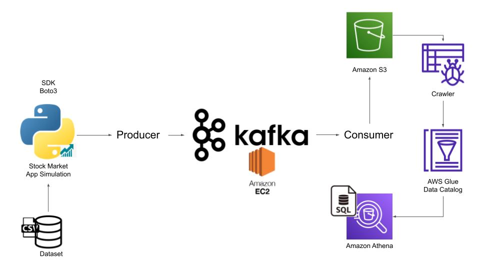

# MarketPulse MCP

> Real-time market intelligence pipeline and MCP skill server for AI agents.

**Repository:** [askmy-stack/Market-Pulse-MCP](https://github.com/askmy-stack/Market-Pulse-MCP) · **Project:** MarketPulse MCP

MarketPulse MCP transforms streaming market data into agent-ready context. It ingests stock ticks and news through a Kafka-compatible pipeline (Redpanda), computes rolling features, detects anomalies, correlates news within time windows, and exposes everything via a FastAPI REST API and MCP tools — including the hero tool `explain_stock_move`.

**This is correlation-based market context, not financial advice. MarketPulse does not predict stock prices.**



## Why it exists

AI agents need structured, real-time market context — not raw tick feeds. MarketPulse MCP bridges streaming data engineering and agent tooling:

- **Streaming pipeline** — Redpanda topics, validated Pydantic schemas, consumer groups
- **Intelligence layer** — rolling features, z-score anomalies, news correlation, embeddings
- **Agent interface** — 13 MCP tools connected to live pipeline data
- **Portfolio-ready** — Docker Compose, Grafana, tests, CI, Terraform & Helm skeletons

## Architecture

```
Producers → Redpanda → Consumers/Processor → PostgreSQL → FastAPI + MCP Server
                                                              ↓
                                                    Prometheus → Grafana
```

| Service | Purpose |
|---------|---------|
| `stock-producer` | Stock ticks (mock or yfinance) |
| `news-producer` | Mock / NewsAPI / Finnhub news |
| `stock-consumer` | Persist validated ticks |
| `news-consumer` | Persist news + publish embeddings |
| `stream-processor` | Features, anomalies, context |
| `api` | REST API (port 8000) |
| `mcp-server` | MCP tools for agents |
| `prometheus` | Metrics scraping (port 9091) |
| `grafana` | Dashboards (port 3000) |

See [docs/architecture.md](docs/architecture.md) for details.

## Features

- **9 Kafka topics** — `stock_ticks`, `market_news`, `company_news`, `stock_features`, `stock_anomalies`, `news_embeddings`, `market_context`, `market_briefs`, `pipeline_health`
- **Pydantic event schemas** — validated at every stage
- **Rolling features** — returns, volatility, z-score, volume ratio
- **Anomaly detection** — price z-score + volume spike with severity
- **News correlation** — time-window matching with sentiment
- **News embeddings** — hash or sentence-transformers vectors on `news_embeddings` topic
- **Real data providers** — yfinance, NewsAPI, Finnhub (optional, env-gated)
- **API key auth** — optional `API_KEY` env var with `X-API-Key` header
- **Grafana observability** — auto-provisioned dashboards
- **Mock data by default** — no API keys required

## Quickstart

### Prerequisites

- Docker & Docker Compose
- Python 3.11+ (for local dev)

### Run the full stack

```bash
git clone https://github.com/askmy-stack/Market-Pulse-MCP.git
cd Market-Pulse-MCP
cp .env.example .env
make up
```

Wait ~30 seconds for services to initialize, then:

```bash
curl http://localhost:8000/health
curl http://localhost:8000/symbols
curl http://localhost:8000/explain/AAPL
```

**Grafana:** http://localhost:3000 (admin/admin)  
**Prometheus:** http://localhost:9091  
**API docs:** http://localhost:8000/docs

### Enable real data (optional)

```bash
# In .env
ENABLE_REAL_STOCK_DATA=true   # requires: pip install yfinance
YFINANCE_ENABLED=true
ENABLE_REAL_NEWS_DATA=true
NEWS_API_KEY=your-key
FINNHUB_API_KEY=your-key
```

### Local development (without Docker)

```bash
make install
cp .env.example .env
# Start Redpanda + Postgres separately, then:
make init-db
make api          # Terminal 1
make produce-stock # Terminal 2
make produce-news  # Terminal 3
```

## Agent Workflow

1. Start the pipeline (`make up`)
2. Configure MCP in Cursor — see [examples/mcp/cursor-mcp.json](examples/mcp/cursor-mcp.json)
3. Ask your agent: *"Explain why AAPL moved recently"*
4. Agent calls `explain_stock_move` → gets correlated anomalies + news + disclaimer

```bash
make mcp  # Run MCP server standalone
```

## API Examples

```bash
# Latest quote
curl http://localhost:8000/quotes/AAPL/latest

# With API key auth (when API_KEY is set)
curl -H "X-API-Key: your-key" http://localhost:8000/symbols

# Recent anomalies
curl http://localhost:8000/anomalies

# News sentiment
curl http://localhost:8000/news/sentiment/TSLA

# Generate market brief
curl -X POST http://localhost:8000/brief/market

# Pipeline health
curl http://localhost:8000/pipeline/health
```

Full reference: [docs/api-reference.md](docs/api-reference.md)

## MCP Tools

| Tool | Description |
|------|-------------|
| `explain_stock_move` | **Hero** — full move explanation |
| `get_latest_quote` | Latest price for a symbol |
| `get_stock_features` | Rolling computed features |
| `detect_market_anomalies` | Recent anomalies |
| `summarize_stock_context` | Correlated context |
| `generate_market_brief` | Market-wide brief |
| ... | [Full list](docs/mcp-tools.md) |

## Deployment

| Method | Path |
|--------|------|
| Docker Compose | `docker-compose.yml` (default) |
| Kubernetes Helm | `deploy/helm/marketpulse/` |
| AWS Terraform | `deploy/terraform/` |
| TimescaleDB | Set `POSTGRES_IMAGE=timescale/timescaledb:latest-pg16` |

```bash
make grafana          # Print observability URLs
make terraform-plan   # Preview AWS infrastructure
make helm-install     # Install Helm chart
```

## Makefile Commands

| Command | Description |
|---------|-------------|
| `make up` | Start full Docker stack |
| `make down` | Stop and remove volumes |
| `make produce-stock` | Run stock producer (mock or yfinance) |
| `make produce-news` | Run mock news producer |
| `make api` | Start FastAPI dev server |
| `make mcp` | Start MCP server |
| `make test` | Run pytest |
| `make lint` | Run ruff linter |
| `make grafana` | Show Grafana/Prometheus URLs |
| `make pre-commit` | Run pre-commit hooks |

## Testing

```bash
make install
make test
make lint
pre-commit install && pre-commit run --all-files
```

## Roadmap

See [docs/open-source-roadmap.md](docs/open-source-roadmap.md).

## Original Notebooks

The original Jupyter notebooks are preserved for reference:

- `KafkaProducer.ipynb` — early producer prototype
- `KafkaConsumer.ipynb` — early consumer prototype
- `indexProcessed.csv` — sample processed data

The `src/marketpulse/` package is the production implementation.

## Disclaimer

**MarketPulse MCP provides correlation-based market context for informational and educational purposes only. It does not constitute financial advice, investment recommendations, or price predictions. Past patterns do not guarantee future results. Always do your own research and consult a qualified financial advisor.**

## License

MIT — see [LICENSE](LICENSE)
